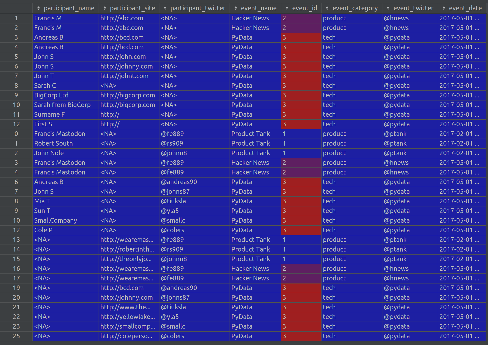

# Exercise

Airfinity needs to link different kinds of data, like event and person lists.

Data comes from different sources and it is not always clear how to link it. Furthermore, records can be inaccurate with missing details and misspellings, and it's not always obvious how best to handle this.

Please find included a sample list of events plus three attendee lists. Given this data, please show how you might link the attendees to the lists and how you'd handle inaccurate and missing data.

Please deliver:

1. a technical solution to this problem in any language
2. a short document explaining your system to a non-technical audience
3. guidance to engineers on how to implement your solution in a production system, at a scale of 100,000 events per day with about 15 attendees per event.

# How to run the assignment

1. `poetry install to install requirements
2. `poetry run python main.py` to run an example from the exercise

# System explanation

1. Participant data comes from three sources. It differs in information about participants as well as event column that can be used to match a corresponding event information.
2. A system allows a loose schema for participants, we allow at least one information about participants to be present.
3. After renaming columns (different names are used per file), we concat all sources and merge then with `event_db`, depending on a field that is present.
4. Some participants have recorded events that are not present in `event_db`. For now, I decided to remove them. Ideally, `event_db` should contain information about all events. In reality, it's a clear sign of a bug that should be fixed in an upstream service.
5. Strong schema validation is applied on the results dataframe. This gives confidence that saved dataset comes in an expected shape.
6. Finally, Here's how final results look like:

Data about events is always available. For participants, we allow at least one field present.

# Guidance to engineers

1. 100,000 events per day requires scalability needs. For this reason, my recommendation is to set up a PySpark cluster that would leverage Pandas API (code migration would be straightforward).
2. This setup would allow for both batch and real time processing (depending on project requirements).
3. Due to very loose structure in input data, a decision should be made on how errors are handled. A goal should be to preserve as much information as it's possible.